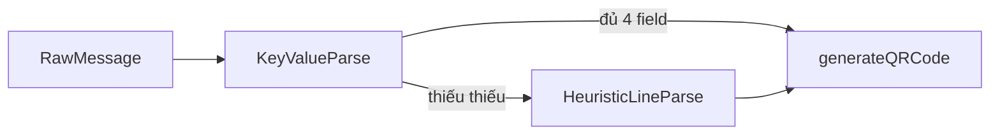

# Nhận dạng thông tin để tạo QR VietQR

## Bot hiện đang dựa vào đâu?

Trong [`controllers/qrCommands.js`](c:\Users\LENOVO\App-bot\Botketoan01\controllers\qrCommands.js), hàm `parseBankInfo` làm theo **heuristic theo dòng**:

| Bước | Dựa vào gì |
|------|------------|
| STK | Dòng **chỉ chứa chữ số** và độ dài ≥ 8 (`/^\d{8,}$/.test(line)) |
| Ngân hàng | Chuỗi dòng khớp một key trong [`utils/bankMapping.js`](c:\Users\LENOVO\App-bot\Botketoan01\utils\bankMapping.js) qua `findBankCode` → mã VietQR `970xxx` |
| Số tiền | Dòng có số + dấu phân cách, dùng `parseSpecialNumber` (không trùng dòng STK) |
| Tên + ghi chú | Các dòng “còn lại”: dòng đầu → tên, phần sau → note |

**Hạn chế trực tiếp với ví dụ của bạn:** dòng có dạng `账号 : 0336157167` hoặc `金额 : 810,000 vnd` **không** khớp regex “chỉ STK” vì có chữ và dấu phân cách — nên parser hiện tại thường **trả null** (không đủ điều kiện).

## Cách giải quyết tổng quát (thiết kế 2 lớp)

1. **Lớp 1 – Nhận dạng label (key-value)**  
   Chuẩn hóa text: tách `:` hoặc `：`, bỏ khoảng trắng đầu/cuối, lowercase key.  
   Map từ khóa (đa ngôn ngữ) → trường nội bộ:

   - **STK:** `账号`, `账号`, `số tk`, `số tài khoản`, `stk`, `account`, `account number`, `số tài khoản`, `卡号`…
   - **Tên:** `持卡人姓名`, `tên chủ thẻ`, `tên chủ tk`, `tên`, `tên chủ tài khoản`, `chủ tk`, `account name`, `holder`…
   - **Ngân hàng:** `银行名称`, `ngân hàng`, `bank`, `tên ngân hàng`…
   - **Số tiền:** `金额`, `số tiền`, `amount`, `số tiền ck`, `vnd` (có thể bỏ hậu tố `vnd`)…
   - **Ghi chú:** `备注`, `ghi chú`, `note`, `nội dung ck`, `nội dung`…

   Giá trị: STK extract `[\d]{6,}` (hoặc rule riêng cho từng bank); số tiền dùng lại `parseSpecialNumber` sau khi bỏ `vnd`, khoảng trắng.

2. **Lớp 2 – Fallback khi không có label**  
   Giữ nguyên logic hiện tại `parseBankInfo` (dòng thuần số, dòng có bank, dòng parse amount) — để tương thích tin nhắn đơn giản 5 dòng không nhãn.

## Các scenario thường gặp và cách xử lý

| # | Scenario | Vấn đề | Cách xử lý |
|---|----------|--------|------------|
| 1 | Tin có nhãn `账号 : ...` / `金额 : ...` | Regex STK không khớp | Dùng lớp key-value trước |
| 2 | Thứ tự trường khác nhau | Parser theo dòng cố định sai | Chỉ gán theo **label**, không theo thứ tự ưu tiên |
| 3 | STK có số 0 đầu (0336...) | Một số nơi parse thành số nhỏ | Luôn giữ **chuỗi** STK, không ép `Number` |
| 4 | Tên có dấu, khoảng trắng | Không ảnh hưởng nếu lấy value sau `:` | Trim, giữ nguyên Unicode |
| 5 | Ngân hàng viết tắt / sai chính tả | `findBankCode` trả null | Mở rộng alias trong `bankMapping` + fuzzy (contains, Levenshtein nhẹ) cho tên gần đúng |
| 6 | Một dòng gộp nhiều field | `parseBankInfo` chỉ 1 dòng/field | Tách theo `:` hoặc `|`; nếu không tách được, dùng regex từng field |
| 7 | Số tiền `810,000 vnd` / `810.000` | `parseSpecialNumber` đã có normalize | Chuẩn hóa bỏ `vnd`, `đ`, `dong` trước khi parse |
| 8 | Không có số tiền | VietQR vẫn tạo được | `amount = 0` → URL không có `?amount=` (đã có nhánh trong `generateQRCode`) |
| 9 | Không có note | OK | Bỏ `addInfo` |
| 10 | Tin nhắn chuyển khoản dài (copy từ app) | Nhiều dòng thừa | Chỉ lấy các dòng khớp label; hoặc regex STK + bank + amount trong toàn bộ text |
| 11 | STK dạng thẻ / tài khoản ngắn | Rule `8+` số có thể sai | Cho phép config `minLength` theo bank hoặc 6–10 số phổ biến VN |
| 12 | Nhiều số trong tin (điện thoại, mã) | Nhầm với STK | Ưu tiên dòng có label STK; nếu không có label, dùng **dòng đơn số dài nhất** hoặc số dài nhất sau từ khóa |

## Bot “dựa vào đâu” để nhận dạng? (tóm tắt)

- **Cấu trúc:** label `:` / `:` fullwidth / khoảng trắng.  
- **Từ điển đồng nghĩa** (tiếng Việt / Trung / Anh) để map → field.  
- **Ràng buộc miền:** STK = chuỗi số; bank = map sang mã VietQR; amount = parser số đã có.  
- **Fallback:** logic cũ theo dòng (không đổi hành vi cho user cũ).  
- **Khi không chắc:** có thể trả **hỏi lại** (reply) hoặc “best guess” + caption cảnh báo (tùy bạn muốn UX an toàn hay tự động tối đa).

## File cần chạm khi triển khai (sau khi bạn duyệt)

- [`controllers/qrCommands.js`](c:\Users\LENOVO\App-bot\Botketoan01\controllers\qrCommands.js): thêm `parseBankInfoFromLabel` / gộp vào `parseBankInfo`, gọi trước heuristic fallback.  
- [`utils/bankMapping.js`](c:\Users\LENOVO\App-bot\Botketoan01\utils\bankMapping.js): bổ sung alias nếu có tên ngân hàng hay gõ sai.  
- (Tuỳ chọn) `utils/qrBankKeywords.js` — tập trung từ khóa label để dễ bảo trì.

Không cần đổi API VietQR nếu `generateQRCode` đã nhận đủ `accountNumber`, `bankName` (mapped), `amount`, `accountName`, `note`.
